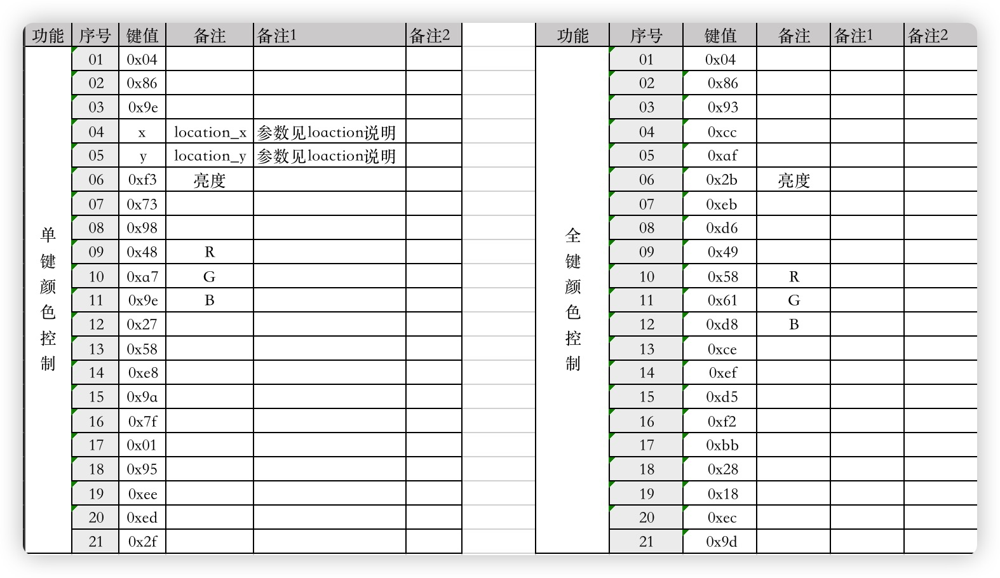

# ifd68_pro_leds_control

## 描述

用于控制ifd68 pro的灯效，仅测试过`macOS 13.2 Beta版(22D5027d),芯片架构ARM64`

`注意`: 目前仅支持有线连接

## 使用方法

首先git clone后进入项目运行，需要安装golang
```bash
git clone https://github.com/lee86/ifd68_pro_leds_control.git
cd ifd68_pro_leds_control & go run ./
```
打开[ifd灯光控制](http://127.0.0.1:8000/)

## 功能

```git
以下为支持的功能
+ 呼吸 + 调整颜色
+ 风车
+ 渐变
+ 流光
+ 滚动
+ 涟漪
+ 常亮 + 调整颜色
+ 星空
+ 亮度 # 貌似有点问题，能调倒是，就是不灵敏
+ 关灯
+ 单键色彩控制 已测试成功，没想好怎么加入页面
以下为不支持的功能
- 音律 #目前不支持，未研究明白怎么进行控制
```

## 参数说明

目前分析到以下数据



## location数据

|序号| key | X | Y |序号| key | X | Y |
|---|---|---|---|---|---|---|---|
|1|right|194|100|35|y|200|107|
|2|pgup|194|102|36|u|200|108|
|3|pgdown|194|103|37|r_alt|201|100|
|4|R_SHIFT|194|105|38|j|201|104|
|5|=|194|106|39|m|201|105|
|6|]|194|107|40|7|201|106|
|7|\\|194|108|41|space_r|202|100|
|8|enter|195|104|42|f|202|104|
|9|up|195|105|43|v|202|105|
|10|back|195|106|44|4|202|106|
|11|del|195|108|45|r|202|107|
|12|left|196|100|46|t|202|108|
|13|;|196|104|47|g|203|104|
|14|/|196|105|48|b|203|105|
|15|0|196|106|49|5|203|106|
|16|p|196|107|50|space_l|204|100|
|17|[|196|108|51|s|204|104|
|18|down|197|100|52|x|204|105|
|19|`|197|101|53|2|204|106|
|20|\"197|104||54|w|204|107|
|21|-|197|106|55|e|204|108|
|22|fn|198|100|56|space|205|100|
|23|k|198|104|57|d|205|104|
|24|,|198|105|58|c|205|105|
|25|8|198|106|59|3|205|106|
|26|i|198|107|60|L_alt|206|100|
|27|o|198|108|61|cap|206|104|
|28|r_ctrl|199|100|62|L_SHIFT|206|105|
|29|l|199|104|63|esc|206|106|
|30|.|199|105|64|tab|206|107|
|31|9|199|106|65|q|206|108|
|32|h|200|104|66|a|207|104|
|33|n|200|105|67|z|207|105|
|34|6|200|106|68|1|207|106|

## 感谢

[Ldream-bit/Web](https://github.com/Ldream-bit/Web)

[sstallion/go-hid](https://github.com/sstallion/go-hid)
